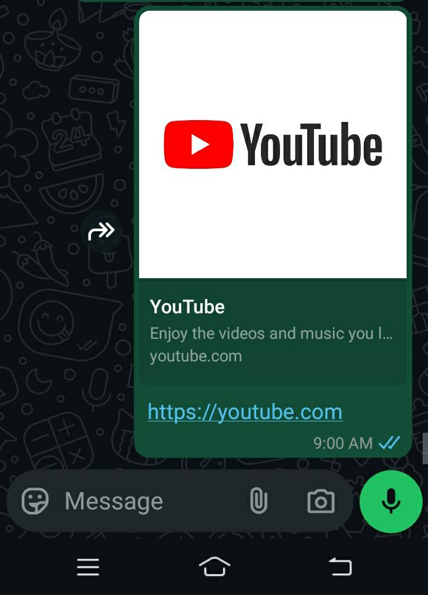
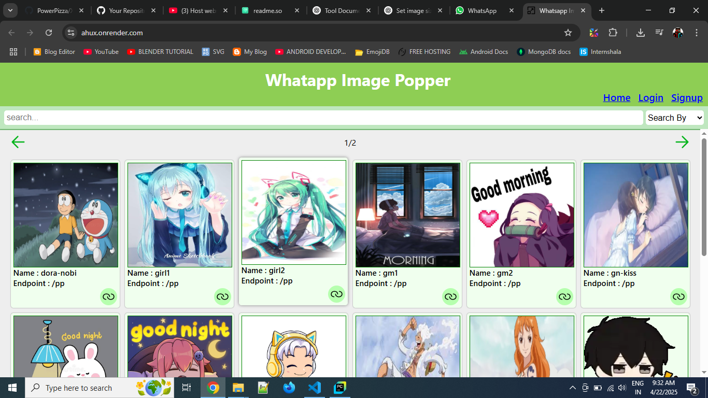

# Whatsapp-Image-Popper

As you may know, when you paste a website or image link into the message box on WhatsApp, it often generates a preview above the text area. This preview typically includes the site’s logo or a thumbnail image. When you send the message, the preview is sent along with it and remains visible in the chat. For example, try sending https://youtube.com in WhatsApp—you’ll see that YouTube’s logo appears as a preview.  

The tool **WhatsApp-Image-Popper** allows you to generate a custom image preview in WhatsApp, just like the previews shown when sharing links. To do this, the image you want to display must first be added to the tool’s database through its dashboard. We’ll cover how to add images in a later section. 

# How it works ?
On this tool, users first create an account and upload images to their personal dashboard. Once the images are uploaded, they can use specific link patterns (explained below) in their WhatsApp chats to load and preview the images they've uploaded through the tool’s dashboard.  
When users upload images to this tool, the entries are saved under their account but can be accessed by anyone using the correct link patterns (explained below). This means that anyone with the right link can trigger that image to pop up in their WhatsApp chats as well. In essence, every image upload contributes to a shared database that powers image popups.  
Since multiple users can upload images with the same name, I’ve introduced endpoints (also explained below) to differentiate between users. Each endpoint uniquely identifies the uploader, ensuring the correct image is loaded even if the name is the same.

# How to use only ?
Go to https://ahux.onrender.com, where you’ll see a collection of images along with their names and endpoints. Browse through the available images, and once you’ve found the one you want to send, return to WhatsApp and open the chat where you want to share the image.  
  
Now type the link pattern given below in the chat.  

## Link Patterns
These link patterns are designed to be copy-pasted directly or typed manually into WhatsApp, allowing you to load and preview your desired image through WhatsApp’s link preview feature.
1. > https://ahux.onrender.com/use/ENDPOINT_NAME/IMAGE_NAME

2. > https://ahux.onrender.com/use/IMAGE_NAME
   
>> **Note:** Make sure to replace `ENDPOINT_NAME` with the actual endpoint you copied from the website, and `IMAGE_NAME` with the exact name of the image you want to send.

## Significance of Links With and Without Endpoints
In *Pattern 1*, we use the format `ENDPOINT_NAME/IMAGE_NAME`. This ensures that the exact image is loaded, even if different users have uploaded images with the same name. Each endpoint uniquely identifies a user, so using a specific endpoint guarantees that the image previewed in WhatsApp is the one uploaded by that particular user.

However, in *Pattern 2*, where the link does not include an `ENDPOINT`, the tool simply searches for the image by name. If only one image exists with that name, it will be loaded. But if multiple users have uploaded images with the same name, the tool may select and preview any one of them at random in WhatsApp.

# How to Add and Use Custom Images with This Tool ?
## STEP 1: Create an account on [ahux](https://ahux.onrender.com/)
* Go to https://ahux.onrender.com/signup
* Put a secure *username* and *password*.
* Put a small, easy and simple endpoint name, which will make your endpoint to being easily used by other users.
* Then click signup button to create account.
> NOTE: Make sure to remember your `username`, `password` and `endpoint`.
* ### Login
    If you already have an account so go to https://ahux.onrender.com/login and login to your account.

## STEP 2: Uploading a new image.
* After creating your account or logging into your account go to https://ahux.onrender.com/dashboard
* Put an easy, relatable and simple image name.
* Go to google or any other platform where you have found the image, copy the link of image.
* Paste the image link in the input field.
* Below that if you can see the preview of your image so you are good to go, your image will be loaded in whatsapp.
* Scroll down and click on *Add*
* ### If you want to upload image from Google so here's how to properly copy the image link in both PC and Mobile.
  [How to copy image link from Google in PC](copy_image_link_pc.mp4)  
  [How to copy image link from Google in Mobile](copy_image_link_mobile.mp4)  
  Image URL needed to be copied properly due to it will decide size of image popup.

## STEP 3: Using the uploaded image.
* Open whatsapp, type any link pattern given above but make user to put your account's endpoint at place of `ENDPOINT` and your image name at place of `IMAGE_NAME`

## STEP 4 (optional) : Deleting an image.
* If you want to delete the uploaded image go to https://ahux.onrender.com/management
* Click on delete button to delete the image you want.

# More Info ⓘ
* You can upload a maximum of 70 images per account. This limit is in place due to database storage constraints.
* GIF files are not supported. Since WhatsApp link previews do not support GIFs, this tool cannot display them either.
* We generally recommend using the second link pattern, as it is shorter and easier to type in chats. However, if you know the specific endpoint that contains the image you want, you can use the first link pattern for more accuracy.
* Only image links can be added to the tool at the moment. Direct file uploads are not supported yet, but this feature may be added in the future.

# Cautions ⚠️
* Do not share your username or password. If someone gains access, they can upload images to your account without your permission.
* Avoid uploading video links, GIFs, or unsupported media formats. These are not compatible and will not work with the tool.
* Ensure the image resolution is at least 300×168 pixels. Lower-resolution images may still appear, but they will show up very small in the WhatsApp preview popup.
* Do not link personal or sensitive images. All uploaded images become part of a public database, meaning anyone with the link can access and use them.

## License
This project is licensed under the MIT License - see the [LICENSE](LICENSE) file for details.

© 2025 Scihack/PowerPizza. All rights reserved.

